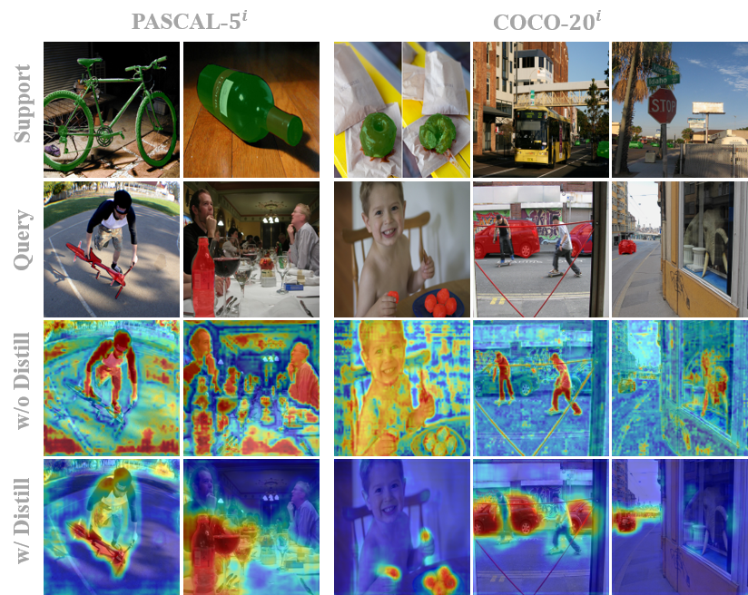

# Hierarchical Dense Correlation Distillation for Few-Shot Segmentation

📢Thanks for your interest in our work! This is the official implementation for our **CVPR 2023** [paper](https://arxiv.org/abs/2303.14652) "*Hierarchical Dense Correlation Distillation for Few-Shot Segmentation*". And we also released the corresponding [models](https://mycuhk-my.sharepoint.com/:f:/g/personal/1155186045_link_cuhk_edu_hk/Eo5I56lRAOlIrKqcpFvA7NYBvvhR3QI8Gn_KLDdn9bb95A?e=YudoGF).

<!-- > **📢Temporary Statement !!!**:
Thank you for your interest in our work! We have received many requests regarding our code and are excited to announce that we have released the raw code and [models](https://mycuhk-my.sharepoint.com/:f:/g/personal/1155186045_link_cuhk_edu_hk/Eo5I56lRAOlIrKqcpFvA7NYBvvhR3QI8Gn_KLDdn9bb95A?e=YudoGF). However, please note that we have not yet provided any supplementary explanations. We will be releasing the reproduction guidance soon, so please stay tuned! 💻👀

🔬 You can start by reproducing our work based on our code. Please note that the experimental results may vary due to different environments and settings, which may sometimes lead to higher mIoU results than reported in the paper by up to 1.0%. However, it is still acceptable to compare your results with those reported in the paper. -->

> **Abstract:** *Few-shot semantic segmentation (FSS) aims to form class-agnostic models segmenting unseen classes with only a handful of annotations. Previous methods limited to the semantic feature and prototype representation suffer from coarse segmentation granularity and train-set overfitting. In this work, we design Hierarchically Decoupled Matching Network (HDMNet) mining pixel-level support correlation based on the transformer architecture. The self-attention modules are used to assist in establishing hierarchical dense features, as a means to accomplish the cascade matching between query and support features. Moreover, we propose a matching module to reduce train-set overfitting and introduce correlation distillation leveraging semantic correspondence from coarse resolution to boost fine-grained segmentation. Our method performs decently in experiments. We achieve 50.0% mIoU on COCO dataset one-shot setting and 56.0% on five-shot segmentation, respectively.*
<p align="middle">
  
</p> 


## Get Started

### 📘 Environment

- python == 3.8.13
- torch == 1.12.1
- torchvision == 0.13.1
- cuda == 11.0
- mmcv-full == 1.6.1
- mmsegmentation == 0.27.0

Please refer to the guidelines in [MMSegmentation v0.27.0](https://github.com/open-mmlab/mmsegmentation/tree/v0.27.0).

### 📝Dataset
Please download the following datasets:

+ PASCAL-5<sup>i</sup>: [**PASCAL VOC 2012**](http://host.robots.ox.ac.uk/pascal/VOC/voc2012/) and [**SBD**](http://home.bharathh.info/pubs/codes/SBD/download.html)

+ COCO-20<sup>i</sup>: [**COCO 2014**](https://cocodataset.org/#download).

We follow the lists generation as [PFENet](https://github.com/dvlab-research/PFENet) and upload the [Data lists](https://mycuhk-my.sharepoint.com/:f:/g/personal/1155186045_link_cuhk_edu_hk/Eo5I56lRAOlIrKqcpFvA7NYBCiAzbB-mgdJwXNd4H6IPRQ?e=oufe8a). You can direct download and put them into the `./lists` directory.

💥 Please ensure that you uncomment the data list generation sections and generate the base annotation when running the code for the first time. More details refer to `util/get_mulway_base_data.py` and `util/dataset.py`

## Models

We have adopted the same procedures as [BAM](https://github.com/chunbolang/BAM) for the [pre-trained backbones](https://mycuhk-my.sharepoint.com/:f:/g/personal/1155186045_link_cuhk_edu_hk/Eo5I56lRAOlIrKqcpFvA7NYBCiAzbB-mgdJwXNd4H6IPRQ?e=oufe8a), placing them in the `./initmodel` directory. We have also uploaded the complete [trained model](https://mycuhk-my.sharepoint.com/:f:/g/personal/1155186045_link_cuhk_edu_hk/Eo5I56lRAOlIrKqcpFvA7NYBCiAzbB-mgdJwXNd4H6IPRQ?e=oufe8a) of COCO dataset for your convenience. For Pascal dataset, you can directly retrain the models since the traing time is less than 10 hours. 


To reproduct the results we reported in our paper, you can just download the corresponding models and run test script. But we still highly recommond you to retrain the model. Please note that the experimental results may vary due to different environments and settings. We sometimes get higher mIoU results than reported in the paper by up to 1.0%. However, it is still acceptable to compare your results with those reported in the paper only. Wish you a good luck! 😄😄

## Scripts
- First update the configurations in the `./config` for training or testing

- Train script
```
sh train.sh [exp_name] [dataset] [GPUs]

# Example (split0 | COCO dataset | 4 GPUs for traing):
# sh train.sh split0 coco 4
```
- Test script
```
sh test.sh [exp_name] [dataset] [GPUs]

# Example (split0 | COCO dataset | 1 GPU for testing):
# sh test.sh split0 coco 1
```


## References

This repository owes its existence to the exceptional contributions of other projects:

* Segformer: https://github.com/NVlabs/SegFormer
* BAM: https://github.com/chunbolang/BAM
* PFENet: https://github.com/dvlab-research/PFENet
* PSPNet: https://github.com/hszhao/semseg

Many thanks to their invaluable contributions.

## BibTeX

If you find our work and this repository useful. Please consider giving a star :star: and citation &#x1F4DA;.

```bibtex
@article{peng2023hierarchical,
  title={Hierarchical Dense Correlation Distillation for Few-Shot Segmentation},
  author={Peng, Bohao and Tian, Zhuotao and Wu, Xiaoyang and Wang, Chenyao and Liu, Shu and Su, Jingyong and Jia, Jiaya},
  journal={arXiv preprint arXiv:2303.14652},
  year={2023}
}
```
